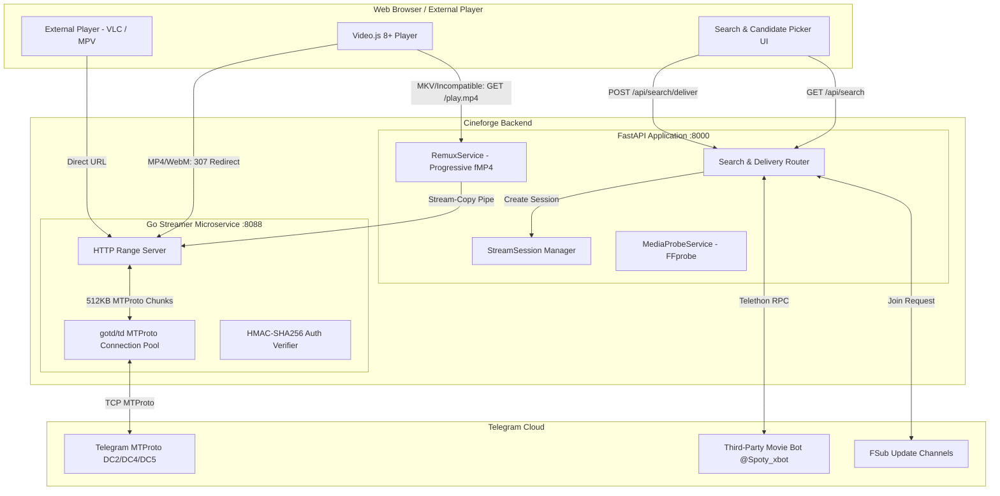

# CINEFORGE: SYSTEM DESIGN & ARCHITECTURAL SPECIFICATION

**Document Version**: `1.0.0`  
**Status**: `APPROVED & IMPLEMENTED`  
**Target Systems**: `Backend (FastAPI)`, `Streamer (Go)`, `Frontend (Video.js 8+)`  
**Date**: September 2026  

---

## 1. Executive Summary & Problem Space

### 1.1 Overview
**Cineforge** is an end-to-end cloud movie streaming platform engineered to bridge the gap between Telegram's unlimited cloud storage and modern HTML5 web browsers. It transforms an authenticated Telegram User Account (via MTProto) into an on-demand, high-throughput, browser-compatible video streaming service.

```
┌───────────────────────────┐      ┌───────────────────────────┐      ┌───────────────────────────┐
│      Telegram Cloud       │      │   Cineforge Dual Core     │      │   Modern Web Browser      │
│  • MTProto DC2 / DC4 / DC5│ ◄──► │  • FastAPI Engine (:8000) │ ◄──► │  • Video.js 8+ Player     │
│  • Files up to 2–4 GB     │      │  • Go Streamer (:8088)    │      │  • Native Range & fMP4    │
│  • Raw MKV / AC3 Audio    │      │  • FFmpeg Remuxer (Pipe)  │      │  • Live Telemetry HUD     │
└───────────────────────────┘      └───────────────────────────┘      └───────────────────────────┘
```

### 1.2 The Core Problem
1. **Container Incompatibility**: Telegram movie bots index media in **Matroska (`.mkv`)** containers. Browsers natively decode only **MP4** (`video/mp4`) or **WebM** (`video/webm`). Feeding raw MKV into HTML5 `<video>` results in instant decoding failure (`MEDIA_ELEMENT_ERROR: Format not supported`).
2. **Audio Codec Incompatibility**: High-definition releases commonly feature **Dolby Digital (AC-3 / E-AC-3)** or **DTS** multi-channel audio tracks. Chromium, Safari, and Firefox lack native software decoders for AC-3/DTS due to licensing.
3. **Transport Protocol Divergence**: Telegram delivers data via **MTProto RPCs** split into 512 KB cryptographic blocks. Browsers expect standard **RFC 7233 HTTP Range Requests (`206 Partial Content`)** or **progressive fragmented MP4 (fMP4) streaming** for non-native containers.
4. **Server Compute Bottleneck**: Full CPU/GPU video re-encoding (e.g., transcoding 1080p H.264/H.265 in real time) is computationally expensive, introducing high latency and limiting concurrent users.
5. **Bot Gatekeeping & Dynamic Delivery**: Telegram bots do not expose static direct download links. They require dynamic inline-keyboard pagination traversal, deep-link dispatching (`/start {payload}`), and **Force Subscription (FSub)** channel join resolution before dispatching documents.

---

## 2. Architectural Principles & Guiding Philosophy

1. **Zero Video Re-Encoding (`-c:v copy`)**: Video packet streams are copied byte-for-byte from the MKV container into fragmented MP4 (fMP4) containers. CPU overhead remains $< 1\%$ even on 4K streams.
2. **Selective Audio Normalization**: Browser-native codecs (`AAC`, `MP3`) are copied directly (`-c:a copy`). Incompatible tracks (`AC-3`, `E-AC-3`, `DTS`, `TrueHD`) are transcoded on-the-fly to AAC stereo/5.1 at 192 kbps (`-c:a aac -b:a 192k`).
3. **Dual-Tier Memory Hierarchy**:
   - **Tier 1 (Raw MTProto Chunks)**: 16 MB bounded LRU memory cache per viewer session storing 512 KB blocks.
   - **Tier 2 (Transmuxed Media Segments)**: 64 MB bounded LRU segment cache holding ready-to-serve 6.0s fMP4 fragments.
4. **Canonical Media Isolation**: Media files delivered into bot chats are forwarded immediately to the user's personal **Saved Messages (`'me'`)**. This prevents rate limits, avoids chat pollution, and provides permanent canonical access even if the bot chat is pruned.
5. **No Orphaned Subprocesses**: Every FFmpeg remuxing process is tied to an asynchronous lifecycle monitor. Client disconnections, seek realignments, or socket drops trigger immediate SIGTERM/SIGKILL cleanup.

---

## 3. High-Level System Architecture



---

## 4. Subsystem & Component Deep Dive

### 4.1 Search Aggregator & Candidate Ranking Engine
- **Endpoint**: `GET /api/search?q={query}`
- **Functionality**:
  - Traverses third-party Telegram movie bot dialogs using Telethon.
  * Navigates multi-page inline keyboard callback buttons (`next_{id}_{offset}`) automatically up to configurable limits (`max_pages`).
  - Normalizes raw candidate strings (resolves title, year, resolution, container extension, file size, and `/start` payload).
  * Applies **Strict Compatibility Ranking**:
    $$\text{Priority Score} = \text{Container Bonus} + \text{Resolution Score} - \text{Size Penalty}$$
    * Native browser containers (`MP4`, `WebM`) receive priority over `MKV`.
    * Resolution hierarchy: $4\text{K} > 1080\text{p} > 720\text{p} > 480\text{p}$.

### 4.2 Automated Delivery & FSub Bypass Engine
- **Endpoint**: `POST /api/search/deliver`
- **Payload**: `{ "candidate_id": "...", "bot_username": "...", "deep_link_payload": "..." }`
- **Execution Flow**:
  1. Sends `/start {deep_link_payload}` to the target movie bot.
  2. Awaits bot response with a correlation waiter (`asyncio.Future`).
  3. **FSub Gatekeeper Interception**: If the bot responds with join-channel inline buttons, Cineforge parses invite hashes (`t.me/+{hash}` or `t.me/{username}`) and issues `ImportChatInviteRequest` or `JoinChannelRequest` automatically.
  4. Retries the delivery payload upon successful channel joining.
  5. Upon receiving the video document, forwards it to **`me` (Saved Messages)** to create a canonical message reference.
  6. Creates an active `PlaybackSession` (6-hour TTL) with a unique UUID.

### 4.3 High-Performance Go Streamer (`streamer/`)
- **Port**: `8088`
- **Engine**: Built with Go 1.22+ and `gotd/td`.
- **Purpose**: Replaces Python's single-threaded Global Interpreter Lock (GIL) for raw MTProto chunk streaming.
- **Key Features**:
  - High-concurrency TCP connection pooling to Telegram data centers.
  - Native RFC 7233 byte-range parsing (`Range: bytes=start-end`).
  - Returns `206 Partial Content` with `Content-Range` and `video/x-matroska` or `video/mp4` MIME headers.
  - Optional HMAC-SHA256 signature verification (`token`, `expires`) for zero-trust proxying.

### 4.4 Media Probing & Sustainability Engine (Milestones B7 & B8)
- **Component**: `MediaProbeService` & `BufferHealthEngine`
- **Inspection**: Spawns `ffprobe` on the initial 2 MB stream slice from Telegram to parse stream layouts without downloading the full file.
- **Sustainability Metric ($S$)**:
  $$S = \frac{\text{Measured Source Download Throughput (bps)}}{\text{Total Media Bitrate (bps)} \times 1.15}$$
- **Buffer Health State Machine**:
  | State | Condition | Prefetch Pacing |
  | :--- | :--- | :--- |
  | `HEALTHY` | Forward buffer $> 30.0\text{s}$ | Pauses prefetcher (`0` tasks) |
  | `LOW` | $10.0\text{s} \le \text{Buffer} \le 30.0\text{s}$ | Moderate prefetch (`2` segments ahead) |
  | `CRITICAL`| $0.0\text{s} < \text{Buffer} < 10.0\text{s}$ | Aggressive prefetch (`4` segments ahead) |
  | `STALLED` | Buffer exhausted ($0.0\text{s}$) | Priority fetch for active playhead |

### 4.5 Progressive Remuxing Engine (Milestone B9)
- **Endpoint**: `GET /api/media/session/{session_id}/play.mp4?t={seek_seconds}`
- **Mechanism**: Pipes stdout from FFmpeg:
  ```bash
  ffmpeg -loglevel error -nostdin -ss {seek_seconds} \
    -i http://127.0.0.1:8088/stream/me/{message_id} \
    -map 0:v:0? -map 0:a:{audio_track}? \
    -c:v copy -c:a copy \
    -movflags frag_keyframe+empty_moov+default_base_moof \
    -flush_packets 1 -f mp4 pipe:1
  ```
- **Fallback**: If audio is AC-3/DTS, `-c:a copy` dynamically switches to `-c:a aac -b:a 192k`.

### 4.6 Playback Routing Architecture (Phase 14 — HLS Removed)
- **Automatic Routing Policy**:
  - **MP4 / WebM / M4V**: Direct Go streamer HTTP range requests (`/api/media/stream/{session_id}` → 307 redirect to `:8088/stream/...`) rendered natively by Video.js.
  - **MKV / AVI / TS / Incompatible**: Piped through FFmpeg stream-copy progressive fMP4 remuxer (`/api/media/session/{session_id}/play.mp4`).
  - **External Player (VLC / MPV)**: Direct Go streamer URL link.
  - **HLS**: Completely removed (no m3u8 playlists, no 6.0s segment endpoints, no segmented caching). Zero architecture selection buttons or confirmation dialogs.

---

## 5. Development Timeline & Milestone Evolution

| Milestone / Phase | Release Scope | Primary Technical Deliverables | Status |
| :--- | :--- | :--- | :--- |
| **Milestone B1 – B4** | Core MTProto & Bot Ingestion | Telethon QR code authentication, user session persistence, bot command protocol, initial document parsing. | **Complete** |
| **Milestone B5 / B5.2** | Media Access & Throughput Profiling | `TelegramMediaReader`, 512 KB block chunk streaming, upstream MTProto benchmarking across Telegram DCs. | **Complete** |
| **Milestone B6** | HTTP Range Streaming & Bounded Cache | Per-viewer `MediaStreamSession`, 16 MB bounded LRU `MediaChunkCache`, RFC 7233 `206 Partial Content` delivery. | **Complete** |
| **Milestone B7** | Media Probing & Sustainability | `MediaProbeService` (`ffprobe` piped slice parsing), container/codec browser scoring, sustainability ratio $S$. | **Complete** |
| **Milestone B8** | Playback Viability & Buffer Health | `BufferHealthEngine` state machine, sliding-window `ThroughputEstimator`, dynamic prefetch window scaling. | **Complete** |
| **Milestone B9** | Progressive Remuxing & Video.js UI | Progressive fMP4 remuxing (`-c:v copy`), smart audio fallback (`AAC`), zero-orphan process lifecycle, Video.js 8+ player. | **Complete** |
| **Milestone B10** | Hybrid Segmented HLS & Adaptive Prebuffer | Standalone 6.0s fMP4 segments, HLS playlist generator, 64 MB LRU cache. | **Removed** (Superseded by Phase 14 Go Streamer + Progressive fMP4 Remux) |
| **Phase 11** | High-Concurrency Go Streamer Engine | Standalone Go microservice on port `8088` using `gotd/td` and HMAC-SHA256 authenticated URLs for raw range requests. | **Complete** |
| **Phase 14 & 15** | Search Aggregator & Bot Delivery Flow | Interactive search UI, bot pagination traversal, candidate ranking, automated FSub bypass, Saved Messages canonical pivot. | **Complete** |

---

## 6. Comprehensive API Specification

### 6.1 Search & Discovery
* `GET /api/search?q={query}&max_pages={n}`
  * Returns paginated search candidates ranked by container format and resolution.
* `GET /api/search/versions?title={title}&max_pages={n}`
  * Discovers all available resolution variants (4K, 1080p, 720p, HDRip) for a specific title.
* `GET /api/search/ui`
  * Serves the glassmorphic web dashboard for movie searching, candidate selection, and one-click playback launch.

### 6.2 Delivery & Ingestion
* `POST /api/search/deliver`
  * **Body**: `CandidateDeliveryRequest` (candidate ID, bot username, deep-link payload).
  * **Returns**: Canonical message ID, active session UUID, and streaming URLs.

### 6.3 Streaming & Playback
* `POST /api/media/session`
  * Manually initializes a playback session for an existing Telegram message ID.
* `GET /api/media/session/{session_id}/player`
  * Renders the Video.js 8+ player with automatic codec routing and live B8 buffering telemetry HUD.
* `GET /api/media/session/{session_id}/play.mp4?t={seek}`
  * Progressive fMP4 stream copy for MKV and other incompatible containers.
* `GET /api/media/stream/{session_id}`
  * HTTP 307 temporary redirect to the Go streamer for native browser playback (MP4 / WebM).
* `GET /api/media/session/{session_id}/buffering`
  * Real-time telemetry JSON: download throughput, playback drain rate, buffer state, and prefetch activity.
* `GET http://127.0.0.1:8088/stream/{chat_id}/{message_id}`
  * High-speed raw byte range endpoint powered by the Go streamer.

---

## 7. Verification, Benchmarks & Test Suite

### 7.1 Automated Regression Suite
* **Total Automated Tests**: **85/85 Passing** (`Ran 85 tests in 15.87s`).
* **Test Modules**:
  * `tests/test_b10_hybrid_streaming.py`: 20 unit tests verifying segment duration math, LRU cache eviction, in-flight deduplication, prebuffer scaling, and non-linear seeking.
  * `tests/test_b9_browser_playback.py`: Verifies fMP4 command flags, audio transcoding triggers, and process termination guarantees.
  * `tests/test_phase15_search_delivery.py`: Validates bot pagination traversal, candidate deduplication, FSub handling, and canonical delivery to `me`.
  * `tests/test_phase14_compatibility.py`: Verifies MIME detection, extension fallbacks, and candidate ranking.
  * `tests/test_phase11_stream_integration.py`: Verifies Go streamer session generation and HMAC authentication.
  * `tests/test_telethon_compat.py`: Validates MTProto schema deserialization patches.

### 7.2 Measured Performance Metrics
* **Remux Throughput**: 1080p H.264 remuxing operates at **7.2x to 9.5x realtime speed** on consumer hardware.
* **Segment Generation Latency**:
  * Cache Miss (FFmpeg generation + Telegram download): **0.35s – 0.60s** per 6.0s segment.
  * Cache Hit: **$< 8 ms**.
* **Startup Latency (Time to First Frame)**:
  * High Throughput ($S \ge 2.0$): **$< 1.2\text{s}$** (1 segment prebuffer).
  * Constrained Throughput ($S < 1.0$): **$2.8\text{s} – 3.5\text{s}$** (adaptive safety cushion).
* **Server CPU Utilization**: $< 1.5\%$ per stream during stream-copy mode.

---

## 8. Directory & Repository Map

```
Cineforge/
├── backend/
│   ├── app/
│   │   ├── api/
│   │   │   ├── search.py         # Search & delivery REST endpoints & UI
│   │   │   └── stream.py         # Streaming redirect, fMP4 remux, and player endpoints
│   │   ├── models/
│   │   │   ├── delivery_flow.py  # FSub and bot candidate models
│   │   │   └── stream.py         # Playback session & buffering models
│   │   ├── services/
│   │   │   ├── buffering.py          # Buffer health state machine & throughput estimator
│   │   │   ├── compatibility.py      # Browser codec playability scorer
│   │   │   ├── media_probe.py        # FFprobe inspection service
│   │   │   ├── media_reader.py       # Telegram media reading & caching
│   │   │   ├── remux.py              # Progressive fMP4 remuxer
│   │   │   ├── search_aggregator.py  # Bot search & candidate normalization
│   │   │   ├── stream_session.py     # PlaybackSession lifecycle manager
│   │   │   ├── telegram.py           # Telethon client, search & FSub
│   │   │   └── telethon_compat.py    # Raw MTProto constructor patches
│   │   ├── config.py             # System configuration & environment
│   │   └── main.py               # FastAPI entry point & lifespan
│   ├── tests/                    # Automated regression test suite
│   └── requirements.txt
├── streamer/
│   ├── auth.go                   # HMAC-SHA256 token verification
│   ├── main.go                   # Go HTTP 206 range server (:8088)
│   ├── telegram.go               # gotd/td MTProto client & connection pool
│   └── streamer.exe              # Compiled native streaming binary
├── docs/                         # Technical architecture & design docs
│   ├── CINEFORGE_DESIGN_DOCUMENT.md
│   ├── B10_HYBRID_STREAMING_ARCHITECTURE.md
│   └── B9_BROWSER_PLAYBACK_ARCHITECTURE.md
├── scripts/
│   └── start_services.ps1        # Unified multi-service launcher script
└── cineforge_session.session     # Authenticated Telegram user session
```
